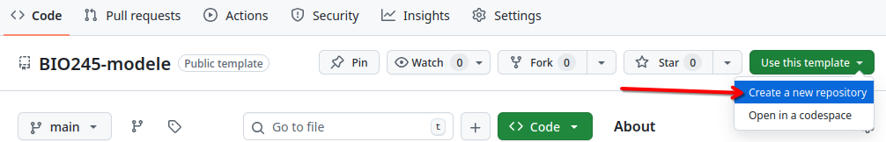
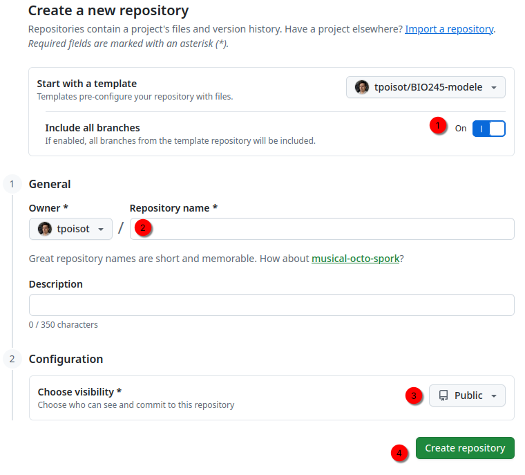

# Dépôt modèle pour le cours BIO 2045

<!-- Vous devrez supprimer les instructions, incluant ce commentaire -->

⚠️ **Important**: Vous devrez mettre à jour le document `README.md`, pour enlever les instructions d'installation, et ajouter les informations pertinentes pour le projet

⚠️ **Important**: Vous devrez utiliser le document `travail.jl` pour écrire votre code / rapport, et **vous ne pouvez pas le renommer**

ℹ️ **Information**: [Guide d'utilisation de markdown](https://docs.github.com/en/get-started/writing-on-github/getting-started-with-writing-and-formatting-on-github/basic-writing-and-formatting-syntax)

ℹ️ **Information**: Les références doivent aller dans le fichier `references.bib` au format bibtex, qui peut être généré par [Zotero](https://www.zotero.org/) ou [zoterobib](https://zbib.org/)

_Pour utiliser ce modèle, vous devez utiliser l'option "Use this template", puis "Create a new repository"_

_Vous devrez ensuite vous assurer que l'option "Include all branches" est cochée, puis choisir le nom du dépôt, et vous assurer qu'il soit visible, avant de le publier_

_Une fois que le dépôt est créé, vous devrez ajouter quelques informations à votre dépôt_

_Les informations doivent être les suivantes. Les tags `bio2045` et `h26-devoir2` (ou `h26-devoir3`) sont essentiels!_

<!-- Vous devrez supprimer jusqu'à, et incluant ce commentaire -->

## Organisation du projet

## ETC

## Consignes 
En utilisant le code de la séance sur les modèles de transition végétale, simulez une intervention et évaluez son efficacité. Les consignes spécifiques sont dans les instructions de l'activité.
Ce travail reprend le code pour la séance sur les transitions végétales. On vous demande d'introduire une deuxième espèce de buissons, afin de simuler l'aménagement d'un corridor sous une ligne électrique à haute tension.

Pour atteindre un équilibre entre biodiversité et sécurité des infrastructures, on établit le mandat suivant: à l'équilibre, il faut que 20% des parcelles soient végétalisées, et que parmi ces 20%, 30% soient des herbes, et 70% soient des buissons. Il faut que la variété de buisson la moins abondante ne représente pas moins de 30% du total des parcelles occupées par des buissons.

Le corridor qu'on souhaite aménager se découpe en 200 parcelles, qui sont toutes initialement vides (on vient de dégager le trajet pour la ligne à haute tension), mais vous pouvez planter jusqu'à 50 parcelles avec un mélange de buissons de votre choix.

Identifiez (i) une population initiale et (ii) une matrice de transition, qui décrit les caractéristiques des espèces à planter, qui permettent de garantir que les critères fixés seront respectés dans au moins 80% des simulations. Comparez ces résultats aux résultats d'un modèle non stochastique.